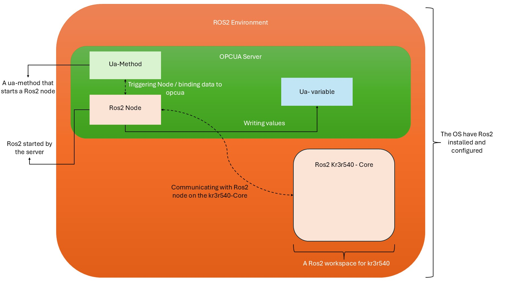
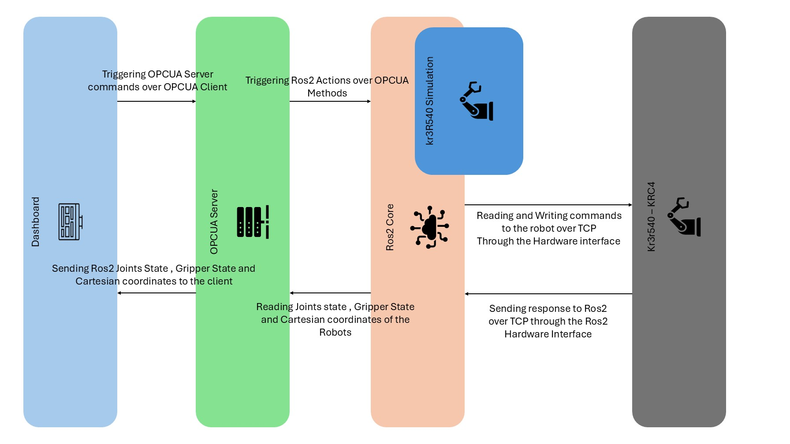

# OPCUA and Ros2 Server 

## Index

- [OPCUA and Ros2 Server](#opcua-and-ros2-server)
  - [Index](#index)
  - [Concept](#concept)
    - [Top Level Sequence](#top-level-sequence)
  - [Classes and Structure](#classes-and-structure)
  - [Sequences and connectivity](#sequences-and-connectivity)
    - [Start System](#start-system)
    - [Publishing simulation joint state to opcua client](#publishing-simulation-joint-state-to-opcua-client)
    - [Stop publishing the simulation joint state to opcua client](#stop-publishing-the-simulation-joint-state-to-opcua-client)
    - [Send Goals (To Simulation)](#send-goals-to-simulation)
    - [Start Digital Twin](#start-digital-twin)
  - [Usage](#usage)
  - [Tests](#tests)

## Concept 

The main idea is to build ros capabilities within an OPCUA server , so that Ros2 is some kind of a Plugin of an OPCUA server.

After building the needed Ros2 packages in the **[ros2 kr3r540-Core](../ROS2_Env/Ros2_Of_Kr3.md)** , the ros2 layer of the system is ready to be used by the opcua server.

Now when we create  a uamethod to communicate with the **ros2 kr3r540-core** ,the method must have a ros2 node binding in the background .
The Ros2 node in the OPCUA server environment should always run on a separate thread due to it being mostly a sub/pub  node that need to be always alive until the OPCUA-Client stops it .

After triggering the Ros2 node the Ros2 node subs/pubs to a Ros2 topic of the **ros2 kr43r540 Core** so that the server can interact with the robot (real and simulation)
After that the Ros2 Node in the OPCUA server environment can grab the values that we need and publish them to the OPCUA server as a OPCUA-variable which is continually updated until the OPCUA-Client stops it.

### Top Level Sequence

Here we can see how the different layers of the system interacts with each other.

A User using the **Dashboard** triggers a method that is **ua-method** on the opcua client side , this then triggers an **ua-method** on the opcua server side , that triggers a Ros2 node (inside the server) to start the communication with the **ros2 Kr3r540 core** that controls the real and simulated robot .
On the other hand the Robot (real or simulation) can send the data through the **ros2 kr3r540 core** over to the **opcua server** by exposing the **Ros2 node** that is responsible to update an **OPCUA server variable** after that the opcua client simply read the variable and updates it.

## Classes and Structure

## Sequences and connectivity  

### Start System 

The System starts after the opcua client connects to the server and the client triggers the opcua_server method **LaunchRos2System** which starts the **kr3r540_System.launch.py** [file](../ROS2_Env/kr3r540_ws/src/kr3r540_bringup/launch/kr3r540_system.launch.py) that starts the ros2 system .

### Publishing simulation joint state to opcua client

After starting the system , by calling the **SubscribeToJointState** the opcua server triggers a ros2 node that is NOT a part of the kr3r540-core but a part of the opcua server , the node is called [**simulation_joint_state_subscriber**](../OPCUA_Server/OPCUA_ros2_control/ros2_simulation_joint_state_node.py) .

This node subscribes to the ros2 specifically to the **/kr3r540_sim/joint_states** and publishes them to the opcua server every (0.5)s 

### Stop publishing the simulation joint state to opcua client

Here the Client triggers **UnsubscribToJointState** and if joints are active then the server kills the **simulation_joint_state_subscriber** and thus stops the subscriber to the **ros2-system**.

### Send Goals (To Simulation)

now if the system has been started (ros2-system is running) the client can trigger the **ignition simulation** by sending a goal message **[ x , y, z, roll, pitch, gripper_sate]** to a **ros2 kinematics action server** via a **ros2 action client** .
the **action server** then takes to goal and applies **Inverse Kinematics** to create a **JointTrajectory message** that the **action server** sends to the **ros2_kr3r540_simulation controllers** which then moves the robot to the goal position.

### Start Digital Twin

Here if the system is started (ros2 system) and the joints of the simulation under **/kr3r540_sim/joint_states** then the server starts a ros2 node **inside the opcua server workspace!** that takes the values from the opcua server and publish them to the **real robot controllers**.

## Usage

## Tests